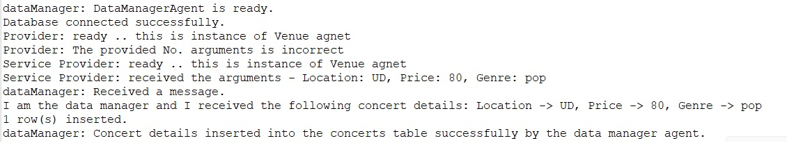
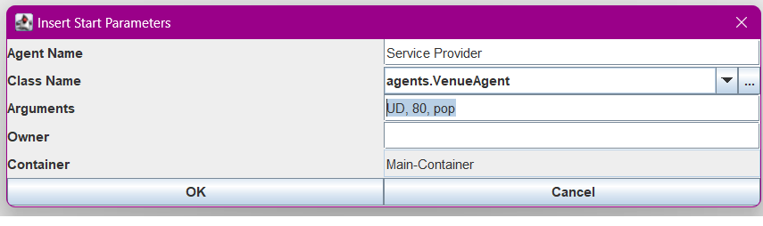
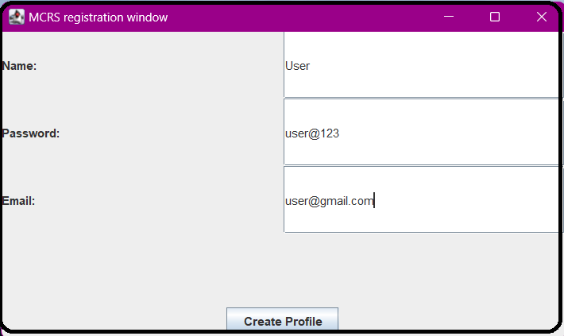
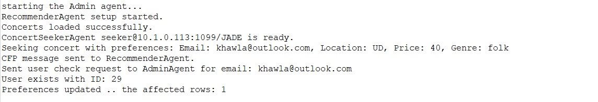
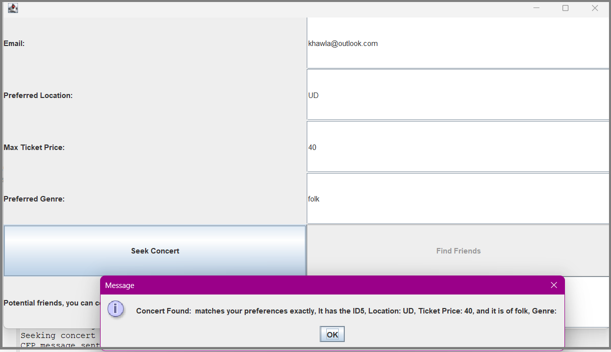
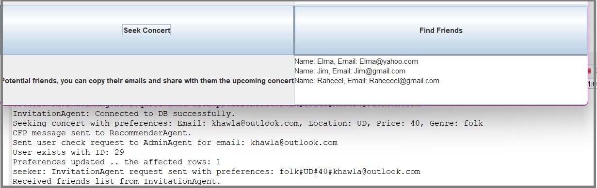

# SENG969-Project-Team1

**This repository contains the source code for Assignment 3 of the SENG696 course. It includes SQL files for setting up database tables, the necessary jar files, and an updated version of Assignment 2, which now features inter-agent messaging in XML format.**   
**This document offers detailed steps on how to run our code, along with the sequence for initializing the agents. Additionally, it provides a description and specifications of our implementation for the Multi-Agent Music Concert Recommender System (MCRS).**
## How to run our code:  
- Create a new Java project.
- Add the jar files as external libraries. (Jade and mysql-connector-j-8.0.31.jar).
- Import the src/agents.
- Run configurations:  
  - Create new Java App and give it a name. 
  - In the Main tab, ensure that the project selected is the one you have just created. The main class should be set to 'jade.Boot' 
  - In the Arguments tab, insert -gui. 
  - Apply and Run. 
  - Each time you want to re-run, just choose the Java App you have created with the specified settings.  

## Once the Jade GUI is visible, you can begin launching/starting the MCRS agents according to the following sequence and specifications:
1. **Data Manager Agent:**
   - **Agent Name:** `dataManager`
   - **Role:** Listens for the VenueAgent to provide upcoming concert details such as location, ticketPrice, and genre.
   - **Expected Arguments:** None
   - **Screenshot Placeholder:**
    

2. **VenueAgent:**
   - **Agent Names:** Any name is acceptable, e.g., `Provider1`.
   - **Role:** Sends concert details to the Data Manager Agent.
   - **Expected Arguments:** location, ticketPrice, genre
   - **Screenshot Placeholder:**
     

3. **Admin Agent:**
   - **Agent Name:** `Admin`
   - **Role:** Creates user profiles and verifies user information.
   - **Expected Arguments:** None
   - **Screenshot of the Admin GUI:**
    
     
     
4. **Recommender Agent:**
   - **Agent Name:** `Recommender`
   - **Role:** Processes user preferences and finds matching concerts.
   - **Expected Arguments:** None
   - **Screenshot Placeholder:**
   - 

5. **ConcertSeeker Agent:**
   - **Agent Names:** Any name is acceptable, e.g., `Seeker1`
   - **Role:** Sends concert seeking requests and enables the 'Find friends' service.
   - **Expected Arguments:** email, location preferences, ticketPrice, genre
   - **Screenshot Placeholder:**
   - 

6. **InvitationAgent:**
   - **Agent Name:** `InvitationAgent`
   - **Role:** Provides 'Find friends' service and updates the friends table.
   - **Expected Arguments:** None
   - **Screenshot Placeholder:**
   - 

## Additional Notes
- The arguments provided are examples. Replace them with actual values as needed.

---
TO access our presentation you can follow this Line:
[The presentation: ](https://gamma.app/docs/Multi-Agent-Music-Concert-Recommender-System-MCRS-qzmlqfdzuavhjel)

