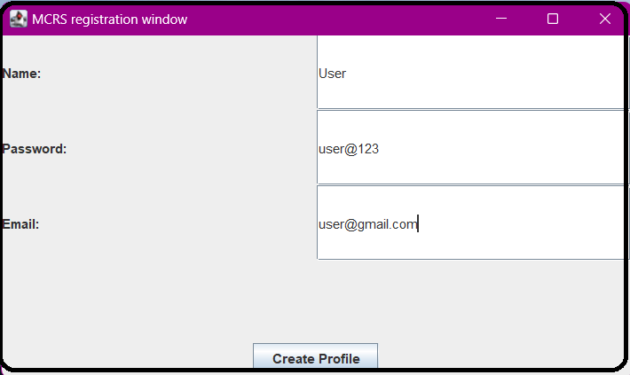

# SENG969-Project-Team1

**This repository contains the source code for Assignment 3 in the SENG696 course. It includes SQL files for the database tables and an updated version of assignment 2 with inter-agent messages in XML.**   
**This document provides a detailed steps on how to run our code along with the sequence for starting the agents. Also, a description of our implementation for the Multi-Agent MCRS, .**
## How to run our code:  
- Create a new Java project.
- Add the jar files as external libraries. (Jade and mysql-connector-j-8.0.31.jar).
- Import the src/agents.
- Run configurations:  
  - Create new Java App and give it a name. 
  - In the Main tab the project should be the same project you have created and the class should be jade.Boot. 
  - In the Arguments tab, insert -gui. 
  - Apply and Run. 
  - Each time you want to re-run, just choose the Java App you have created.  
## Agent Initialization Sequence
1. **Data Manager Agent:**
   - **Agent Name:** `dataManager`
   - **Role:** Listens for the VenueAgent to provide upcoming concert details such as location, ticketPrice, and genre.
   - **Expected Arguments:** None
   - **Screenshot Placeholder:**
    

2. **VenueAgent:**
   - **Agent Names:** Any name is acceptable, e.g., `Provider1`.
   - **Role:** Sends concert details to the Data Manager Agent.
   - **Expected Arguments:** location, ticketPrice, genre
   - **Screenshot Placeholder:**
     

3. **Admin Agent:**
   - **Agent Name:** `AdminAgent`
   - **Role:** Creates user profiles and verifies user information.
   - **Expected Arguments:** None
   - **Screenshot of the Admin GUI:**
    
     
     
4. **Recommender Agent:**
   - **Agent Name:** `RecommenderAgent`
   - **Role:** Processes user preferences and finds matching concerts.
   - **Expected Arguments:** None
   - **Screenshot Placeholder:**
   - 

5. **ConcertSeeker Agent:**
   - **Agent Names:** Any name is acceptable.
   - **Role:** Sends concert seeking requests and enables the 'Find friends' service.
   - **Expected Arguments:** email, location preferences, ticketPrice, genre
   - **Screenshot Placeholder:**
   - 

6. **InvitationAgent:**
   - **Agent Name:** `InvitationAgent`
   - **Role:** Provides 'Find friends' service and updates the friends table.
   - **Expected Arguments:** None
   - **Screenshot Placeholder:**
   - 

## Additional Notes
- The arguments provided are examples. Replace them with actual values as needed.

---

For any issues during the initialization, please refer to our troubleshooting guide or contact the development team.
